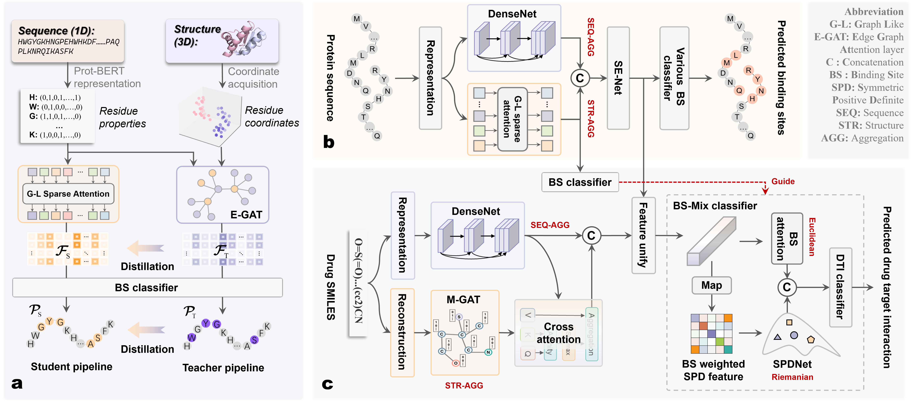

# MFSF
Current deep learning methods for drug-target interaction (DTI) prediction are starting to use binding site (BS) information—but they often fail to extract structural cues from protein sequences or effectively integrate BS data. To tackle this, we introduce MFSF, a unified framework that jointly predicts DTI and BS, all from sequences.
At the core is a distillation-based pretraining process:
A teacher model with an Equivariant Graph Attention (E-GAT) module learns structural patterns from known protein 3D structures.
A student model, using a lightweight Graph-Like sparse attention (G-L) module, learns to capture similar features using sequence data only.
Once trained, the G-L module can be plugged into downstream tasks for efficient and structure-aware sequence encoding.

We also introduce BS-MIX, a classifier that combines Riemannian and Euclidean correlation features and dynamically focuses on BS-relevant regions—boosting both accuracy and interpretability in DTI prediction.


## Installation
**Update**: Now the codes are compatible with PyTorch Geometric (PyG) >= 2.0.
### Dependency
The codes have been tested in the following environment:
Package  | Version
--- | ---
Python | 3.8.0
PyTorch | 1.13.0
CUDA | 11.7
PyTorch Geometric | **2.3.1**
RDKit | 2022.09.5
BioPython | 1.79
### Install via conda yaml file (cuda 11.7)

**Our model consists of three parts: Pretraining process, BS prediction and DTI prediction**


## Pretrained extractor

The source file of the pre-trained model is in "Representation.py", we can run the "main.py" to pretrain the model. 

setting
```python
>>> train_dataset = Protein_pkl_Dataset(root_dir='BS_data/train')
>>> validation_dataset = Protein_pkl_Dataset(root_dir='BS_data/validation')
>>> model = Representation_model(3, 512, 256, 64, 128, batchs, device)
>>> model = model.to(device)
```
Then, the pretrained model that was saved will be used for BS and DTI prediction.

## BS prediction
We can run main.py. This file will also import "merge.py" and "model.py";

example of setting
```python
>>> dataset_name = "DNA"
>>> train_name = "DNA-646"
>>> test_name = "DNA-181"
>>> target_model_state_dict = model.state_dict()
>>> source_model_state_dict = torch.load("output/model/pretrain_new_2")
```
## DTI prediction
We can run main.py. This file will also import "merge.py" and "model.py";

example of setting    
```python
>>> data_select = "D_to_D"
>>> target_model_state_dict = model.state_dict()
>>> source_model_state_dict = torch.load("output/model/pretrain_new_2")
```
The specific data protocols are described in the file "data_merge.py";


